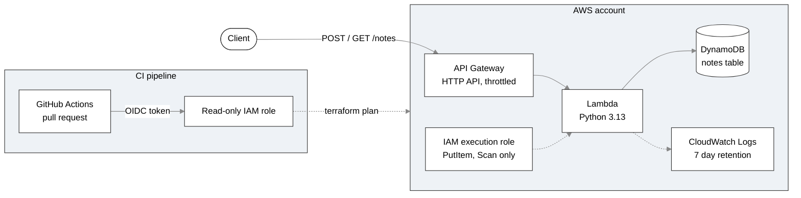

# terraform-aws-serverless-api

A small serverless notes API on AWS, built entirely with Terraform. A client can save a note and list saved notes through an HTTP endpoint, and GitHub Actions checks every pull request with an automated Terraform plan.

This is the third project in a series. The first built a single flat configuration with local state, and the second added modules, remote state, and separate environments. This one moves to serverless services, least-privilege IAM, and a CI pipeline that authenticates to AWS without stored access keys.

## Architecture



## Request flow

1. A client sends a request to the API Gateway URL.
2. API Gateway matches the route (`POST /notes` or `GET /notes`) and forwards the request to Lambda. Any other route is rejected before Lambda runs.
3. The Lambda function validates the input and reads or writes the DynamoDB table.
4. The function runs under an IAM role that allows only two DynamoDB actions on one table, plus writing to its own log group.

## What it builds

| Resource | Purpose |
|---|---|
| DynamoDB table | Stores notes, keyed by a generated `id`, with on-demand capacity |
| Lambda function | Python handler that validates input and reads or writes notes |
| IAM execution role and policy | Allows `PutItem` and `Scan` on the notes table and log writes, nothing else |
| CloudWatch log group | Created explicitly with 7 day retention, so logs do not accumulate forever |
| API Gateway HTTP API | Public endpoint with `POST /notes` and `GET /notes` routes |
| API stage with throttling | Limits sustained traffic to 5 requests per second, with bursts to 10 |
| Lambda permission | Allows this one API to invoke the function |
| GitHub OIDC provider and role | Lets GitHub Actions run `terraform plan` with read-only access and no stored keys |

## Project structure

```
.
├── .github/workflows/
│   └── terraform-plan.yml    fmt check, validate, and plan on pull requests
├── src/
│   └── handler.py            Lambda function code
├── tests/
│   ├── note.json             sample valid request body
│   └── bad-note.json         sample invalid request body
├── main.tf                   table, Lambda, IAM, API Gateway
├── oidc.tf                   GitHub OIDC provider and read-only role
├── variables.tf
├── outputs.tf
└── versions.tf
```

## Prerequisites

- An AWS account and an IAM user configured with `aws configure`
- Terraform 1.10 or later
- An S3 bucket for remote state (created by the bootstrap step of the `terraform-aws-remote-state-modules` project)
- Git, and `curl` for testing

## Usage

### 1. Configure the backend

Create a file named `backend.hcl` in the repo root. It is ignored by Git.

```
bucket       = "tfstate-<account-id>-us-east-1"
key          = "serverless-api/terraform.tfstate"
region       = "us-east-1"
encrypt      = true
use_lockfile = true
```

### 2. Deploy

```
terraform init -backend-config=backend.hcl
terraform plan
terraform apply
```

The outputs include `api_url`, the public endpoint.

### 3. Try the API

Save a note:

```
curl -X POST <api_url>/notes -H "Content-Type: application/json" -d @tests/note.json
```

List notes:

```
curl <api_url>/notes
```

Send invalid input and receive a `400` response:

```
curl -i -X POST <api_url>/notes -H "Content-Type: application/json" -d @tests/bad-note.json
```

### 4. Clean up

```
terraform destroy
```

## API reference

| Method and path | Description | Success | Errors |
|---|---|---|---|
| `POST /notes` | Saves a note from a JSON body with a `text` field | `201` with the saved note | `400` for invalid JSON, empty text, or text over 500 characters |
| `GET /notes` | Returns up to 50 notes | `200` with a JSON list | none |

## CI pipeline

The workflow in `.github/workflows/terraform-plan.yml` runs on every pull request into `main` and on every push to `main`. It runs these steps in order:

1. `terraform fmt -check` fails the run if any file is not formatted. This step needs no AWS access, so it fails fast.
2. The workflow requests short-lived AWS credentials by presenting a GitHub OIDC token.
3. `terraform init`, `validate`, and `plan` run against the real remote state.

Two repository secrets are required: `AWS_ROLE_ARN` (the pipeline role) and `TF_STATE_BUCKET` (the state bucket name). Neither is a credential, and AWS access keys are never stored in GitHub.

The pipeline only plans. Applying changes is a manual step, so a pull request cannot change infrastructure on its own.

## Cost

The project is designed to stay within AWS always-free allowances at low volume. Lambda and DynamoDB storage have permanent monthly free allowances, API Gateway charges are a few cents at most for light testing, and log retention is limited to 7 days. There is no VPC, NAT gateway, or server. Verify current limits on the AWS Free Tier page before deploying, and set a budget alert. The API is public, so the throttling limits exist to cap the damage from unwanted traffic.

## Design decisions

- **Serverless, with no VPC.** Nothing here needs private networking, so the project avoids NAT gateway charges and idle compute cost entirely.
- **Least-privilege IAM.** The Lambda role allows two DynamoDB actions on one table and writes to one log group. Each permission names exact actions and resources.
- **Separate policy statements per resource.** Table access and log access are different statements, so each is scoped to its own resource.
- **Explicit log group with retention.** Lambda creates a log group automatically that keeps logs forever. Defining it in Terraform with 7 day retention prevents slow, silent growth.
- **OIDC instead of stored keys.** GitHub proves its identity with a short-lived token, so there is no long-lived access key to leak or rotate.
- **Trust policy scoped to one repository.** The role accepts tokens only from pull requests and pushes to `main` in this repo.
- **Read-only pipeline role.** The pipeline can plan but not change anything, and applies stay manual.
- **Throttling on the API stage.** Request limits cap how much a runaway client or abuse can cost.
- **Input validation in the handler.** Bad input returns a clear `400` instead of a crash or a junk record.
- **Terraform packages the code.** The `archive` provider zips `src/` and hashes it, so a code change redeploys the function automatically.
- **Account identifiers kept in secrets.** The state bucket name and role ARN contain the AWS account ID, so they live in GitHub secrets and a Git-ignored file.

## Known limitations

- **The API is public and unauthenticated.** Anyone with the URL can write notes. Throttling limits the impact, but real use would add authentication.
- **`GET /notes` uses a table scan.** A scan reads the whole table, and `Limit` only caps the response. A production design would query on a key.
- **The pipeline role uses the broad `ReadOnlyAccess` managed policy.** That is acceptable in a sandbox, and a production setup would list only the services this project uses.
- **One GitHub OIDC provider per account.** If the account already has one, this configuration needs to reference it instead of creating a new one.
- **No automated tests or security scanning yet.** The pipeline checks formatting, validity, and the plan only.

## What I learned

- **One typo can produce dozens of errors.** A missing closing quote in `main.tf` made Terraform treat everything after it as one string. Fixing only the first error cleared nearly all of them.
- **Misspelled arguments appear as two errors.** A typo in `output_path` produced both a "missing required argument" and an "unsupported argument" message.
- **Names can be reserved.** A log group named without the leading slash was rejected because names starting with `aws/` are reserved, and Lambda logs to a group that begins with `/aws/lambda/`.
- **Validation does not check IAM action names.** A wrong action prefix passes `validate` and only fails when the function runs.
- **A failed apply does not roll back.** Resources created before the error stay in state, and re-running apply continues from there.
- **Outputs belong to a folder's state.** Asking for an output from the wrong folder reports it as not found, even though it exists elsewhere.

## Next steps

- Add tflint and Checkov scanning to the pipeline
- Add authentication to the API
- Replace the table scan with a keyed query
- Narrow the pipeline role to only the services this project uses
- Add a manually approved apply job
